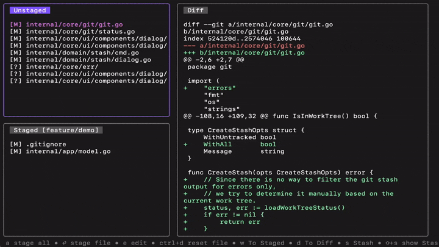

# gitglance

Simple git terminal UI written in Go using [Bubble Tea](https://github.com/charmbracelet/bubbletea).


## Features
- Stage files ✔️
- Unstage files ✔️
- Reset files ✔️
- View diffs ✔️
- Commit ✔️

## Installation
### Go
```
go install github.com/michaelhass/gitglance@latest
```

## Inspiration
- [lazygit](https://github.com/jesseduffield/lazygit)
- [GitUI](https://github.com/extrawurst/gitui)
